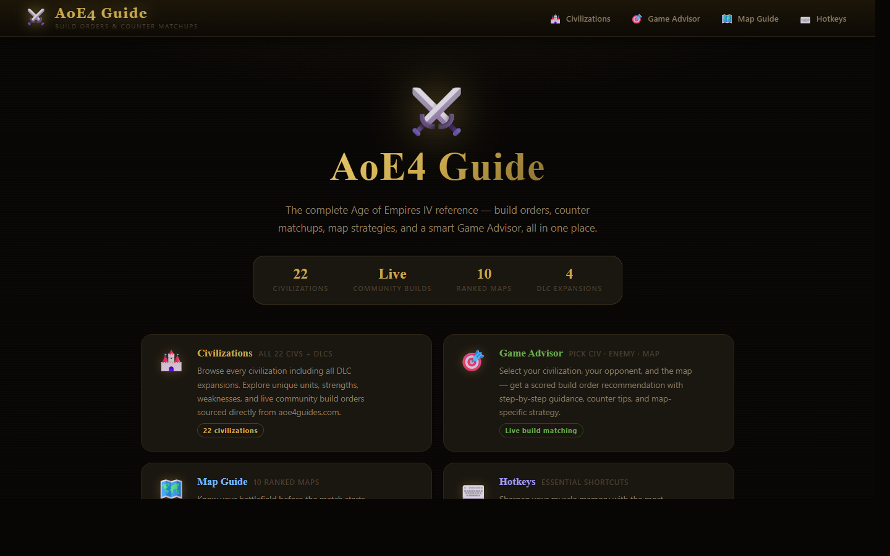

# ⚔️ AoE4 Guide — Build Orders & Counter Matchups

A comprehensive Age of Empires IV reference guide built as a **Power Apps Code App** with React, TypeScript, and Vite. Covers all 22 civilizations (including DLCs), live community build orders, counter matchups, hotkeys, map strategies, and a smart Game Advisor.



---

## Features

- **Welcome Page** — Landing page with feature overview and quick navigation to every section
- **22 Civilizations** — All base game civs + The Sultans Ascend, Knights of Cross & Rose, and Dynasties of the East DLCs, with variant badges and DLC grouping
- **Live Build Orders** — Fetched in real-time from the [aoe4guides.com public API](https://aoe4guides.com/api/api-docs/), sorted by community score, grouped by age (Dark / Feudal / Castle / Imperial), with resource counts per step
- **Counter Matchups** — Head-to-head matchup data with favored/unfavored ratings and counter tips
- **Game Advisor** — Pick your civ, enemy civ, and map → get a scored strategy recommendation, then see the best-matching live community build with full step-by-step detail
- **Hotkeys Reference** — All essential AoE4 hotkeys across Economy, Military, Camera, and Production categories
- **Map Guide** — 10 maps with aggression level, sheep spawn info, key features, how-to-play, and best civilizations

---

## Tech Stack

| Layer | Technology |
|---|---|
| Framework | React 19 + TypeScript |
| Build Tool | Vite 7 |
| Deployment | Power Apps Code App |
| Styling | Pure CSS with CSS custom properties |
| Fonts | Google Fonts — Cinzel (headings) + Inter (body) |
| Routing | Page-level state (no router dependency) |
| Live Data | [aoe4guides.com REST API](https://aoe4guides.com/api/api-docs/) |
| Static Data | TypeScript data files (civs, matchups, maps, hotkeys) |

---

## Getting Started

This app is built as a **Power Apps Code App**. To run it locally and deploy it, follow the official Microsoft guide:

📖 [Create a Power Apps Code App from scratch](https://learn.microsoft.com/en-us/power-apps/developer/code-apps/how-to/create-an-app-from-scratch)

### Local development

```bash
# Clone the repository
git clone https://github.com/Bjoern13-tech/aoe4-guide.git
cd aoe4-guide/my-app

# Install dependencies
npm install

# Start the dev server
npm run dev
```

Then open the local URL shown in your terminal (e.g. `http://localhost:5173`).

```bash
# Production build
npm run build
```

---

## Project Structure

```
my-app/
├── src/
│   ├── components/
│   │   ├── WelcomePage.tsx         # Landing page with feature cards
│   │   ├── CivGrid.tsx             # DLC-grouped civilization sidebar
│   │   ├── CivDetail.tsx           # Civilization detail panel
│   │   ├── BuildOrderView.tsx      # Live build orders from API
│   │   ├── CounterMatchupView.tsx  # Matchup data display
│   │   ├── GameAdvisorPage.tsx     # 3-step advisor with live builds
│   │   ├── HotkeysPage.tsx
│   │   └── MapGuidePage.tsx
│   ├── data/                       # Static game data
│   │   ├── types.ts                # Shared TypeScript interfaces
│   │   ├── civs.ts                 # 22 civilizations
│   │   ├── buildOrders.ts          # Fallback build order data (used by advisor scoring)
│   │   ├── counterMatchups.ts      # Matchup data
│   │   ├── hotkeys.ts              # Hotkey definitions
│   │   └── maps.ts                 # Map data
│   ├── utils/
│   │   ├── aoe4guidesApi.ts        # API client, types, HTML stripper, build ranker
│   │   └── advisorLogic.ts         # Game Advisor scoring algorithm
│   ├── App.tsx                     # Root component + page routing
│   ├── App.css                     # Component styles
│   └── index.css                   # Design system + global styles
└── index.html                      # OG meta tags + favicon
```

---

## Live API Integration

Build orders are fetched live from the [aoe4guides.com public API](https://aoe4guides.com/api/api-docs/) — no API key required, CORS open.

```
GET https://aoe4guides.com/api/builds?civ=ENG&orderBy=score
```

Each civ maps to a 3-letter code (`ENG`, `FRE`, `HRE`, `MON`, `CHI`, `ABB`, `DEL`, `RUS`, `OTT`, `MAL`, `BYZ`, `JAP`, `AYY`, `DRA`, `ZXL`, `JDA`, `HOL`, `KTE`, `GOH`, `MAC`, `SEN`, `TUG`). The app:

1. Fetches the top 10 builds per civ on demand
2. Strips HTML from step descriptions, converting image src paths to readable labels (e.g. `[House]`, `[Lumber Camp]`, `🌾`, `💰`)
3. Groups steps by age section (Dark Age → Imperial Age)

---

## Civilizations Covered

**Base Game (10):** English, French, Holy Roman Empire, Mongols, Chinese, Abbasid Dynasty, Delhi Sultanate, Rus, Ottomans, Malians

**The Sultans Ascend:** Byzantines, Japanese, Ayyubids, Order of the Dragon, Zhu Xi's Legacy, Jeanne d'Arc

**Knights of Cross & Rose:** House of Lancaster, Knights Templar

**Dynasties of the East:** Golden Horde, Macedonian Dynasty, Sengoku Daimyo, Tughlaq Dynasty

---

## Game Advisor

The advisor uses a two-step process:

**Step 1 — Matchup scoring** (static data):
- Base score 50
- Matchup favorability vs. enemy civ: ±20
- Map type vs. playstyle compatibility: ±15
- Civ identity alignment: +10
- Difficulty penalty: −3 / −8

**Step 2 — Live build matching** (API):
- Fetches live community builds for the selected civ
- Ranks them by keyword matching against the recommended playstyle (Rush / Boom / Fast Castle / Defensive)
- Displays the top match with full age-grouped steps, resource counts, author, season, and video link

---

## License

MIT — free to use, modify, and share.

---

*Built as a personal learning project and portfolio demo. Not affiliated with Microsoft or Relic Entertainment.*
